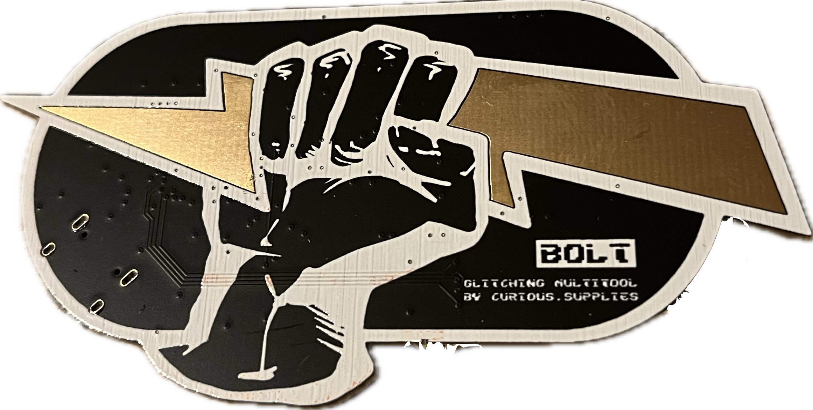

# A new tool to break stuff! ⚒️

The Curious Bolt is a security multi-tool for getting started with hardware hacking. It is simultaneously:
- a programmable crowbar **voltage glitcher** ⚡️
- an **8-channel logic analyzer** 👩‍💻
- and a simple differential power analysis **oscilloscope**. 📉

## How do you turn this on?
See [Getting Started](docs/getting_started.md) for how to set up and use your Bolt.

## Acknowledgements
PulseView scope code by [Jaroslav Kysela](https://github.com/perexg/picoprobe-sump), extended to run in parallel with other functions by Joris Witteman (MIT License)

Software and hardware design by [Joris Witteman](https://github.com/jorisplusplus) for Curious Supplies (MIT License)

PCB art by [ankhaneko.art](https://ankhaneko.art) for Curious Supplies