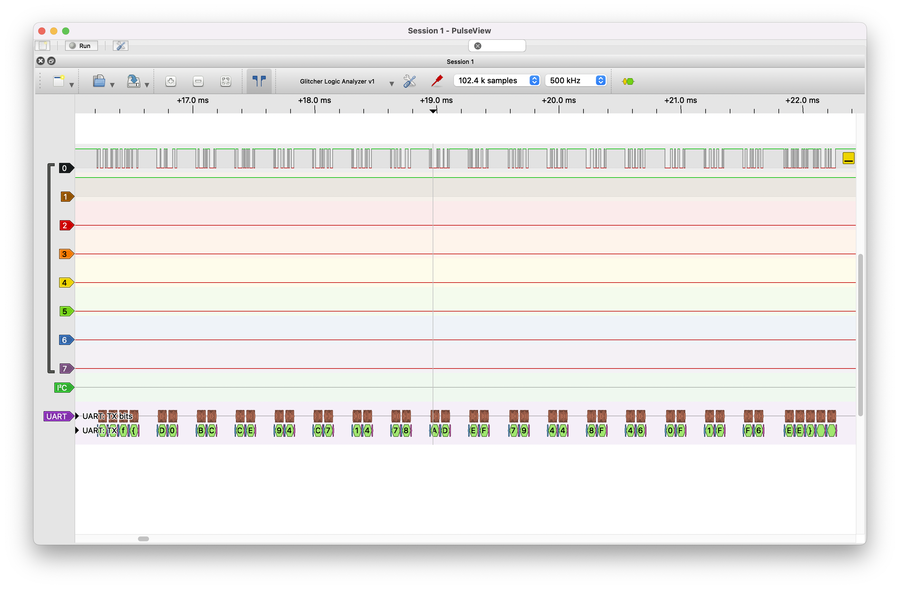
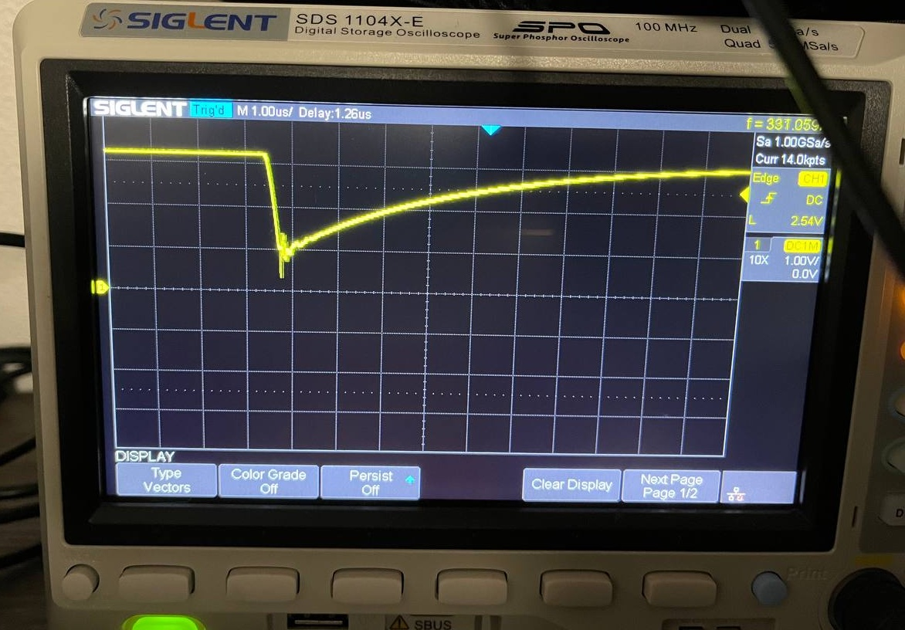

# Getting started

## Setting up your Bolt
The Curious Bolt exposes a serial port over USB that can be used to interface with its glitcher, scope, and programmable I/O.

A python library is available to talk to your Bolt. To use it:

- Install _python_ (3.x) and _pip_
- Install _pyserial_ by running `pip install pyserial`
- Copy [scope.py](../lib/scope.py) to your working directory
- Check if you can connect by running `python3 -c "from scope import Scope;s=Scope()"`. If you get a warning that the Bolt could not be found, check its USB connection.
- If you run Linux and can't connect, check [your udev rules](linux_udev.md).

## Logic analysis in PulseView

See [Logic Analyzer](logic_analyzer.md) for instructions.

## Fault injection with the voltage glitcher

See [Voltage Glitching](voltage_glitching.md) for instructions.

## Programmable I/O
You can get the Bolt to send programmable output patterns on its output GPIO, based on triggers. See [Programmable I/O](programmable_io.md).

## Differential power analysis with the oscilloscope
Documentation for this is in progress.

⚠️ **NOTE FOR ECSC23 PARTICIPANTS**: the scope of your Bolt is not necessary for your challenges, and it will not help you either. For the competition you can ignore this feature.