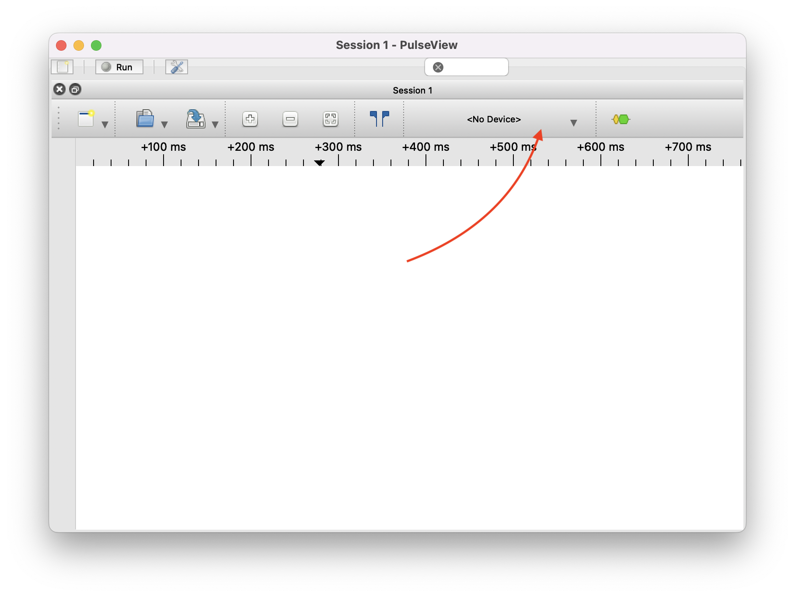

# Using the Curious Bolt as a logic analyzer in PulseView

## How-to
- Install [Pulseview](https://sigrok.org/wiki/Downloads)
- Connect your Curious Bolt via USB
- Open PulseView, and click on "No Device" dropdown

- Select the "SUMP Compatibles" driver, select the first USB serial port of the two exposed by Curious Bolt, set the baudrate to 115200, click on Scan, and then Ok

- See [Pulseview documentation](https://www.sigrok.org/doc/pulseview/0.4.1/manual.html) for how-to of signal capture and protocol decoding